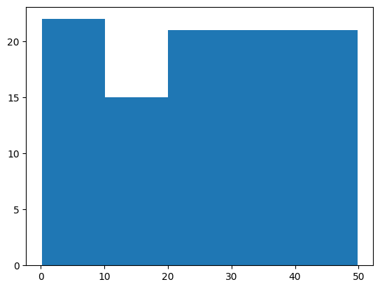
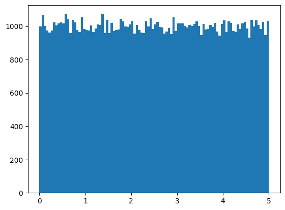
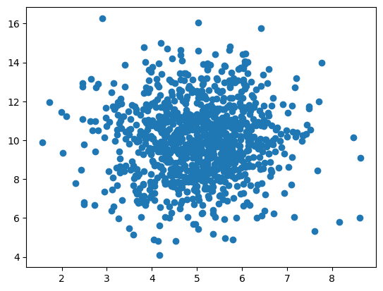
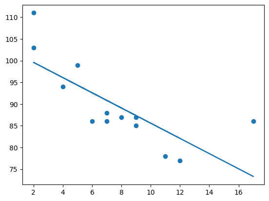
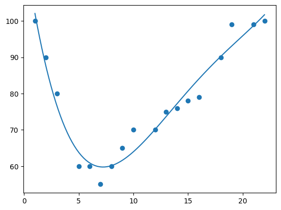
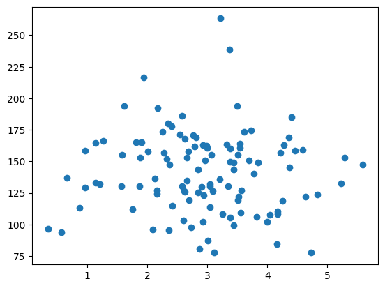
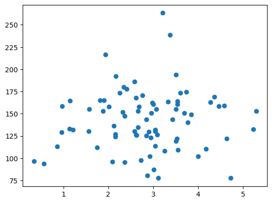
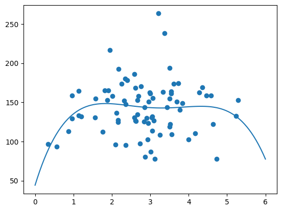
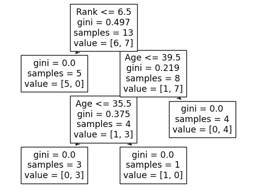

```python
import numpy 
seed = [20,30,40,50,60,70,90]
x = numpy.std(seed)
print(numpy.mean(seed))
display(x)
```

    51.42857142857143
    


    22.31499907401901


```python
#方差 等于 平方差的平均值
seed = [32,111,28,95,49,41,91]
x = numpy.var(seed)
print(x)
print(numpy.std(seed))
```

    996.1224489795917
    31.56140758869274
    


```python
ages = [5,31,43,48,50,41,7,11,15,39,80,82,32,2,8,6,25,36,27,61,31]
ages=[5,6]
x = numpy.percentile(ages, 100)

print(x)
```

    6.0
    


```python
random250 = numpy.random.uniform(-5,5,100)

print(random250)
```

    [ 2.77625449 -3.24049516  2.14372     4.08913479 -3.67527731 -0.30500436
     -3.28357237  3.69799621 -3.59402011 -4.99949843 -3.66823521  1.74313969
      3.92986307  4.40220067 -0.31003235  1.69063644  3.97287975  1.51046985
      4.06370086  4.92371441 -2.36448379  2.98007869 -4.80687328 -4.60825127
      0.01724698  2.79712255 -0.93151594 -2.68236159  0.40229609  0.58014271
     -4.71341871  4.97184991  0.38354352 -2.5821953  -4.1255346   2.58767954
      3.24736681 -4.92093709 -0.85947831 -2.77638424  3.89710975 -4.62053036
      3.24244359  2.14445416 -1.33325421  0.58740225  4.11987837 -0.51632717
      2.75055251 -4.10954259  4.14837375 -0.66795829  1.39756868  1.54690254
     -1.91618048  1.04073217 -0.18039272 -2.75119364 -0.04176422  4.66481826
      1.37659991  0.86374469  3.62231149 -0.77761876  3.39158261 -1.64075743
      0.74593955 -0.30559971 -4.22119917  2.60952217 -1.71564533  1.38212306
      3.67120592  1.0091845   0.9706401   2.76296076  4.26885284  1.64150942
     -1.9934297   4.25837747  2.98525437 -0.47000424 -2.19185076 -0.70826311
     -3.78803241  1.18928226 -2.42942257 -3.3446347   4.69166279  1.08546746
     -0.17561673 -3.11823245  0.64947103 -3.07314891  0.50092833 -3.00729604
      1.46268648  4.14065436  2.57968876  2.22162235]
    


```python
import matplotlib.pyplot as plt

pltx = numpy.random.uniform(0.0,50.0,100)

plt.hist(pltx,5)
plt.show
```


    <function matplotlib.pyplot.show(close=None, block=None)>


    

    


```python
x = numpy.random.uniform(0.0, 5.0, 100000)

plt.hist(x, 100)
plt.show()
```


    

    


```python
x = numpy.random.normal(5.0, 1.0, 1000)
y = numpy.random.normal(10.0, 2.0, 1000)
plt.scatter(x, y)
plt.show()
```


    

    


```python
#linear Regression
from scipy import stats
x = [5,7,8,7,2,17,2,9,4,11,12,9,6]
y = [99,86,87,88,111,86,103,87,94,78,77,85,86]

slope,intercept,r,p,std_err = stats.linregress(x,y)

def myfunc(x):
    return slope *x + intercept

mymodel = list(map(myfunc,x))
print(slope)
print(intercept)
plt.scatter(x, y)
plt.plot(x, mymodel)
plt.show()
```

    -1.7512877115526118
    103.10596026490066
    


    

    


```python
spend = myfunc(199)
print(spend)
```

    -245.4002943340691
    


```python
#Polynomail Regression
x = [1,2,3,5,6,7,8,9,10,12,13,14,15,16,18,19,21,22]
y = [100,90,80,60,60,55,60,65,70,70,75,76,78,79,90,99,99,100]

mymodelPoly = numpy.poly1d(numpy.polyfit(x,y,4))

myline = numpy.linspace(1,22,100)


plt.scatter(x, y)
plt.plot(myline,mymodelPoly(myline))
plt.show()

value = mymodelPoly(17)
print(value)
```


    

    


    87.21097471965427
    


```python
#multiple Regression
import pandas
from sklearn import linear_model
from sklearn.preprocessing import StandardScaler
scale = StandardScaler()

df = pandas.read_csv("data.csv")
X = df[['weight','valume']]
y = df['CO2']

ScaledX = scale.fit_transform(X)
regr = linear_model.LinearRegression()
regr.fit(ScaledX,y)

scaled =scale.transform([[2500,2.8]])

predictedCo2 = regr.predict([scaled[0]])
print(predictedCo2)
```


```python
numpy.random.seed(2)
x = numpy.random.normal(3,1,110)
y = numpy.random.normal(140,30,110)

plt.scatter(x, y)
plt.show()
```


    

    


```python
train_x = x[:80]
train_y = y[:80]

test_x = x[80:]
test_y = y[80:]

plt.scatter(train_x, train_y)
plt.show()
```


    

    


```python
mymodel = numpy.poly1d(numpy.polyfit(train_x,train_y,4))
myline = numpy.linspace(0,6,100)
plt.scatter(train_x, train_y)
plt.plot(myline, mymodel(myline))
plt.show()
```


    

    


```python
from sklearn.metrics import r2_score
r2 = r2_score(train_y,mymodel(train_x))

print(r2)
```

    0.056005650139864915
    


```python
r3 = r2_score(test_y, mymodel(test_x))
print(r3)
```

    -0.1092374193002339
    


```python
print(mymodel(4.1))
```

    144.5642567333365
    


```python
df = pandas.read_csv("data.csv")
d = {'UK':0,'USA':1,'N':2}

df['Nationality'] = df['Nationality'].map(d)
d = {'YES':1,'NO':0}
df['Go'] = df['Go'].map(d)
print(df)
```

        Age  Experience  Rank  Nationality  Go
    0    36          10     9            0   0
    1    42          12     4            1   0
    2    23           4     6            2   0
    3    52           4     4            1   0
    4    43          21     8            1   1
    5    44          14     5            0   0
    6    66           3     7            2   1
    7    35          14     9            0   1
    8    52          13     7            2   1
    9    35           5     9            2   1
    10   24           3     5            1   0
    11   18           3     7            0   1
    12   45           9     9            0   1
    


```python
from sklearn import tree
from sklearn.tree import DecisionTreeClassifier
import matplotlib.pyplot as plt

features = ['Age','Experience','Rank','Nationality']

X = df[features]
y = df['Go']

dtree = DecisionTreeClassifier()
dtree = dtree.fit(X,y)
tree.plot_tree(dtree,feature_names = features)

print("[1] means 'GO'")
print("[0] means 'NO'")
print(dtree.predict([[66, 3, 7, 2]]))
```

    [1] means 'GO'
    [0] means 'NO'
    [1]
    

    c:\Users\PC095\anaconda3\envs\ml\lib\site-packages\sklearn\base.py:450: UserWarning: X does not have valid feature names, but DecisionTreeClassifier was fitted with feature names
      warnings.warn(
    


    

    


```python
print(dtree.predict([[40, 10, 6, 1]]))
```

    [0]
    

    c:\Users\PC095\anaconda3\envs\ml\lib\site-packages\sklearn\base.py:450: UserWarning: X does not have valid feature names, but DecisionTreeClassifier was fitted with feature names
      warnings.warn(
    
